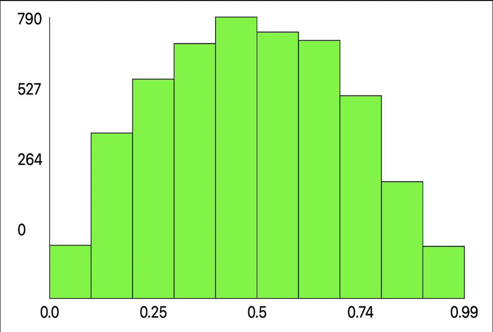

# metropolis

This repository contains my implementation of the [Metropolis algorithm](src/MCMC/Metropolis.swift), which is used for Bayesian statistical analysis, as well as a [custom graph renderer](src/Graphics/Graph.swift). Here is example output from a run of the program.



```
Bayesian Analysis
using Markov chain Monte Carlo
==============================

Observations
------------
  - 2 coin flips
  - 1 head(s)

Prior
-----
  We use an uninformed prior: beta(a=1, b=1)

Likelihood
----------
  P(data|θ) = bernoulli(N=2, z=1)

Metropolis
----------
  We perform the metropolis algorithm to estimate the central tendency of the posterior distribution.
  Random seed: 0.834189865344514
  Steps: 10000
  Burn-in Period: 3000
  Est. Mean: 0.4934783753798731
  Est. StdDev: 0.22304677011859197

Actual
------
  P(θ|data) = beta(a=2, b=2)
  Act. Mean: 0.5 (-1.0% error)
  Act. StdDev: 0.22360679774997896 (-0.0% error)
```
